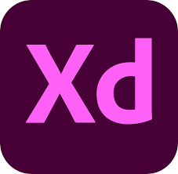

# Pallete
## Personal Color Diagnosis with AI and Recommending Cosmetics
### 2020 Sejong University 창의학기제 프로젝트 3분과 Team 5H

(https://www.youtube.com/watch?v=E-fQqp6jfbw/)

## README
Note: This application is based on the Pixel 3XL, API30 version.
### <With Pallete,measure your personal color>
- Measure your personal color with just A4 paper and a smartphone for FREE.

#### What is Personal Color?
- Personal color is defined in four different tones using the names of the seasons, and consists of warm orange skin tone warm tone and pale pinkish cool tone.
#### The Need for this application
- The largest percentage of Korean smartphone usage time is also in their teens and 20s, and this personal color is gaining sensational popularity on SNS used by the age group.
- However, the cost of diagnosing personal colors ranges from 30,000 won to 150,000 won, which is a bit burdensome for the age group.
- It was not that these applications did not exist at all, but after looking at several applications, we found that white-balancing is not working properly and often results in inaccurate results.
#### How to use?
Note: This application requires a smartphone with internet connection with a4 paper
1. Sign in after registering as a member.
2. You can load or take pictures yourself by pressing the Diagnose button.
   1) Please take a picture from the white light.
   2) Please look at the light as much as you can.
   3) Take a picture of the face and A4 paper so that it doesn't get shadowed.
   4) Put A4 paper next to your face with your left hand and take a picture with your right hand.
3. When the diagnosis is completed, recommend cosmetics that go well with your personal color.
4. Click on the recommended cosmetics to go to the purchase page.
5. On the Community menu, you can share information with other users.

## Info
<table style="text-align:center;">
    <tr>
        <th>Frontend</th>
        <th>Backend</th>
        <th>Crawling</th>
        <th>Database</th>
    </tr>
    <tr>
        <td>
        &nbsp;
           
        </td>
        <td>
        &nbsp;
        
        </td>
        <td> 
        
        </td>
        <td>
        
        </td>
    </tr>
    <tr>
        <td>
        AndroidStudio,AdobeXD
        </td>
        <td>
        Volley,PHP
        </td>
        <td>
        JSoup
        </td>
        <td>
        MySQL
        </td>
    </tr>
</table>

## AUTHORS
|Name|Role|
|---|---|
|<a href="https://github.com/jangziehn">Jaehoon Jang</a>|📊 Main Logic, Research|
|<a href="https://github.com/pppp0722">Ilhwan Lee</a>|🛠 Main Logic, Android|
|<a href="https://github.com/SeHwan96">Sehwan Park</a>|📄 Crawling ,Android|
|<a href="https://github.com/fkrgus222">RackHyun Choi</a>|🖌 UI/UX ,Interface|
|<a href="https://github.com/Jaeyooou">Jaehyun Ahn</a>|📂 DB, Backend|

